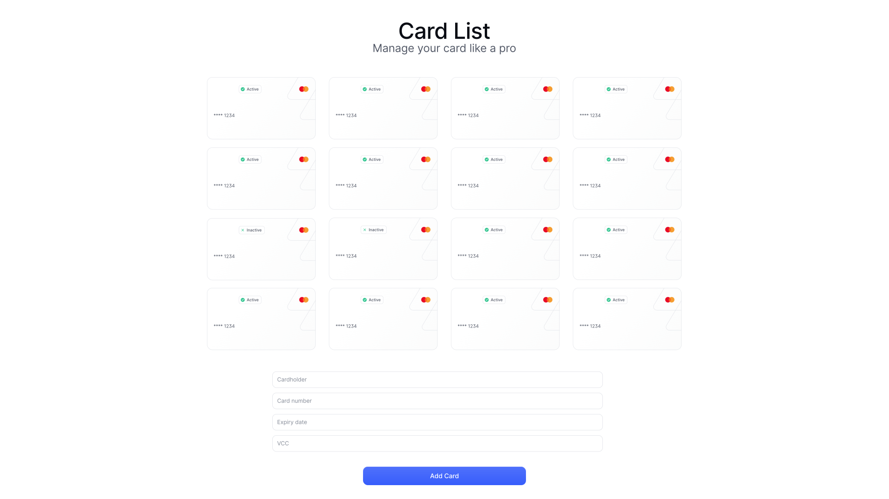

# Technical Interview

Welcome to the Technical Interview!

## Tasks

You are tasked with the following:

- Fix: Match the page to look like the design below:
  
- Feature: Add the remove card button.
- Feature: Hide the card number by default, allow user to show it by clicking on the card number.

Good luck!

## Rules and tips

- Any library that you think will make the job easier is allowed (e.g. Tailwind).
- You are allowed to use Google, Documentation, etc, but please be clear with me when you're using it.
- Communication is very important to us, please talk me through everything you're doing.

## Let's get to work!

First install all of the dependencies:

```sh
$ pnpm install
```

Then run the test server:

```sh
$ pnpm run dev
```

The root of the app is in [./src/App.tsx](./src/App.tsx)
